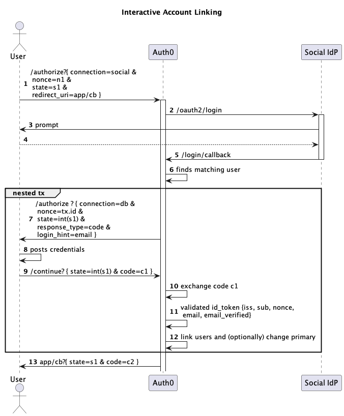
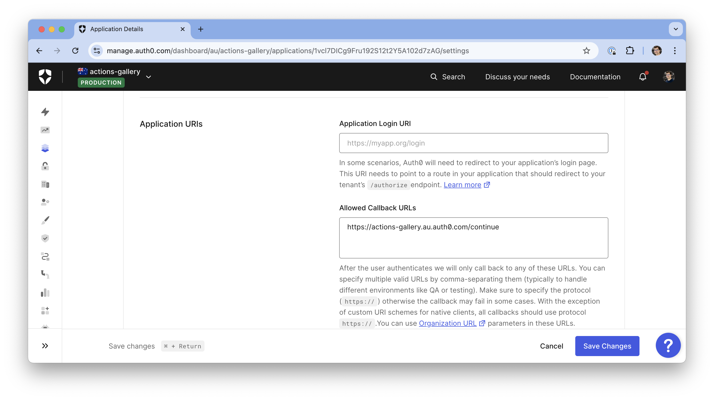

# Interactive Account Linking

## Demo

## Sequence

## Terraform Setup

Visit [post-login-interactive-linking.tf](../../tf/post-login-interactive-linking.tf)

## Manual Setup

### Step 1) Add Regular Web "Account Linking Application"

### Step 2) Set Allowed Callback URL to domain/continue

### Step 3) Enable CC and AC Grants

### Step 4) Add API2 scopes

### Step 5) Enable Connections

### Step 6) Install Post Login Action

Source code [interactive-account-linking.js](interactive-account-linking.js)

### Step 7) Configure Secrets

| Key            | Value                                     |
|----------------|-------------------------------------------|
| `domain`       | your Auth0 domain                         |
| `clientId`     | Account Linking Application Client ID     |
| `clientSecret` | Account Linking Application Client Secret |
| `database`     | Name of Database Connection holding users |

## Silent Account Linking

Visit [silent account linking](../silent-account-linking) for non-interactive linking.
